# School_District_Analysis
## Module 4 - Pandas and Jupyter Notebook

## **Overview of the School District Analysis**
The purpose of this analysis was to provide an overview of the school district's key metrics which include: math and reading scores and percentages based on these scores. After receiving evidence of academic dishonesty, we then reran the analysis omitting Thomas High School Ninth graders and compared the results.
The analysis includes:
- The district summary
- The School summary
- The top 5 and bottom 5 schools
- The average math scores of the students at each grade level per school
- The average reading score of the students at each grade level per school
- school performance based on 
    - budget spend per student
    - school size
    - school type

## **Results**

### - How is the district summary affected?
We removed the ninth grade math and reading scores for Thomas High School, however we did not remove the students from the district student count. After updating the calculations the outcome was that the Average Math Score dropped by 0.1%.

Before the omission:
</img>

After the omission:
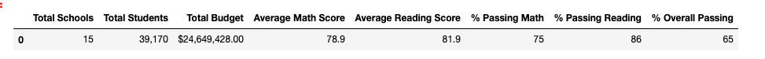</img>

### - How is the school summary affected?

There are some adjustments made for Thomas High School by re-analyzing the Thomas High School summary. The other schools are unaffected.

Before the omission:
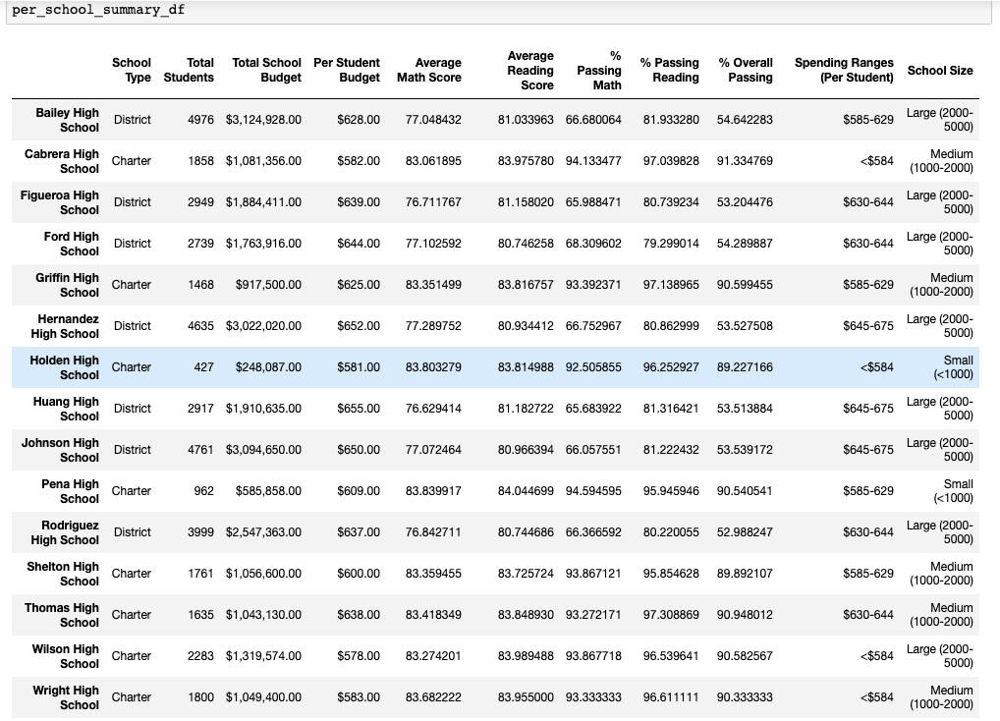 </img>

After the omission:
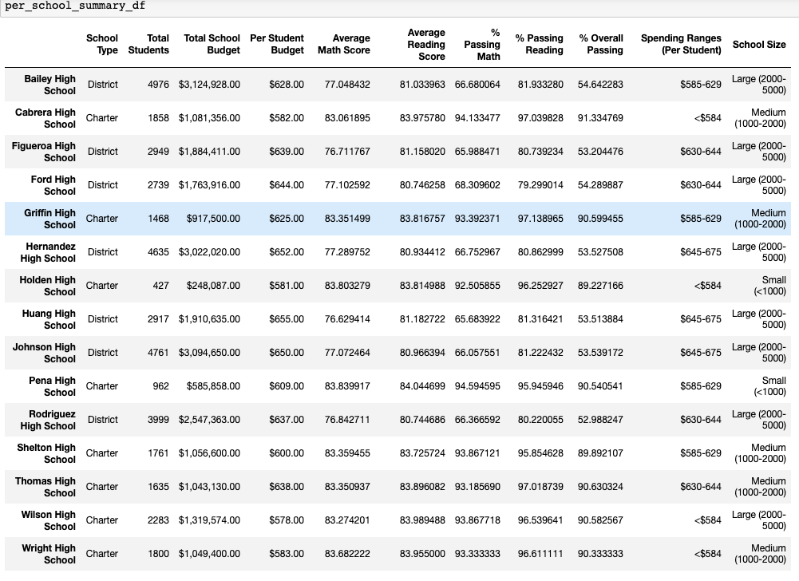</img>

The secondary analysis on Thomas High School tells us that the average math scores decreased from 83.418349% to 83.350937%. 

The reading scores decreased from 83.848930% to 83.896082%. 

The % Passing Math scores decreased from 93.272171% to 
93.185690%.

The % Passing Reading scores decreased from 97.308869% to 97.018739%.

Lastly, the overall passing percentage dropped from 90.948012% to 90.630324%.

### - How does replacing the ninth graders' math and reading scores affect Thomas High School's performance relative to other schools?

As pictured below, replacing the math and reading scores with NaNs for Thomas High School did not affect the school performance in relation to other schools. 

Before the omission:

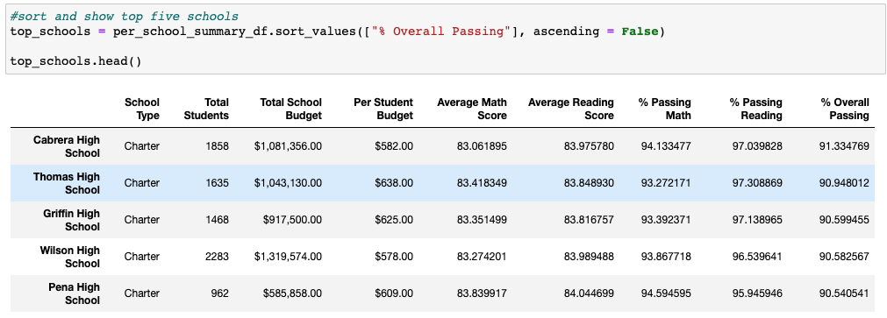</img>

After the omission:
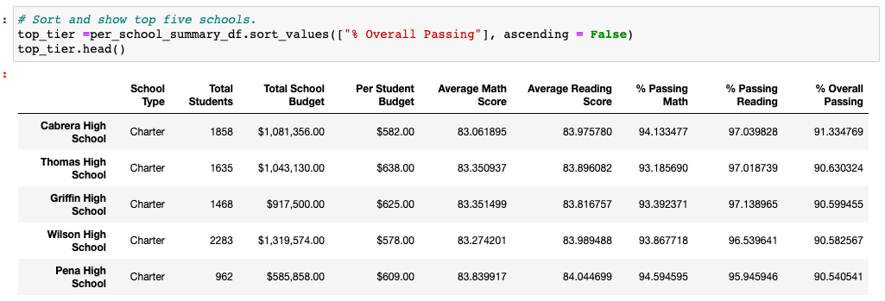</img>

The bottom five schools are unaffected:
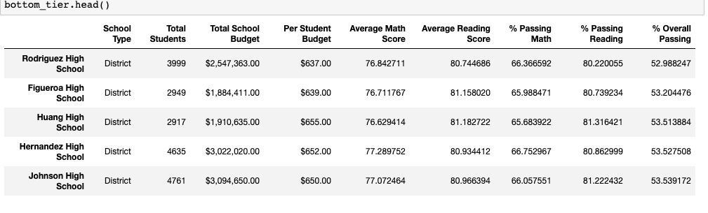</img>

### - How does replacing the ninth-grade scores affect the following:
- Math and reading scores by grade:

    The only output affected is the 9th Grade output for Thomas High Schools Math and Reading scores.         
        
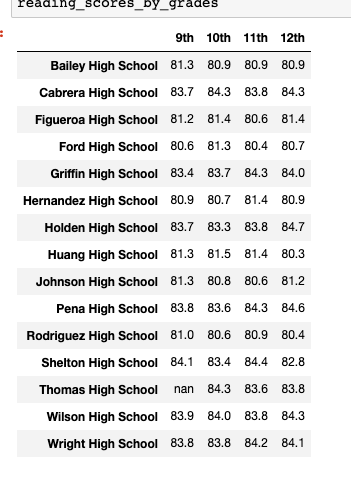</img>
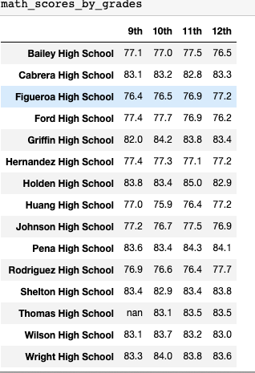</img>

- Scores by school spending, by school size and by school type were unaffected by the re-analyzing the data.

School spending:
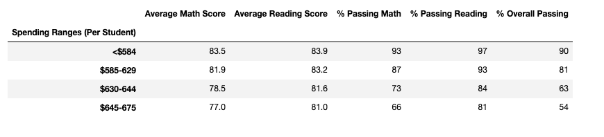 </img>

School Size:
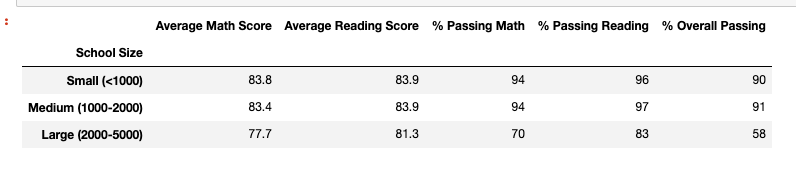 </img>

School Type:
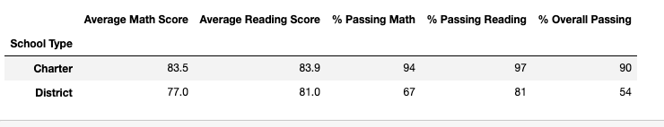 </img>
## **Summary**

1. While reworking our analysis, we removed 461 ninth grade Thomas High School students' math and reading grades from our analysis. The most dependent outcomes are potentially the district averages, Thomas High School's summary and ranking. The entire district holds 39170 students. We removed only 1.2% of the population and as such, many of the outcomes were not statistically significant. 
    
2. While there are small differences between the two analyses within Thomas High School, if the data was to be rounded to the conventional decimal places in the per_school_summary_df, there would be very little difference between the two sets. 

3. The revision of the dataset only affected the district and the school as a whole because throughout the analysis we are comparing the schools averages within the school to the rest of the district.

4. While not affected by the removal of Thomas High School's ninth grade scores, I think it is interesting to note that smaller and chartered schools have the best scores overall, which supports the theory that more individualized attention gains greater statistical results! Spending per student surprisingly decreased scores as the spending increased.